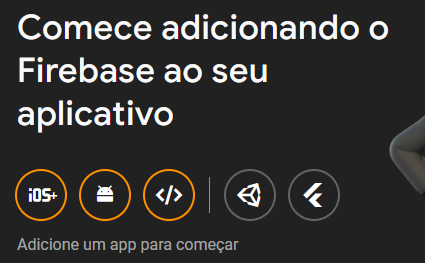
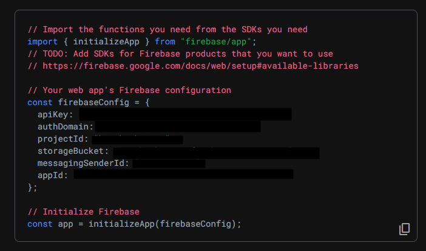
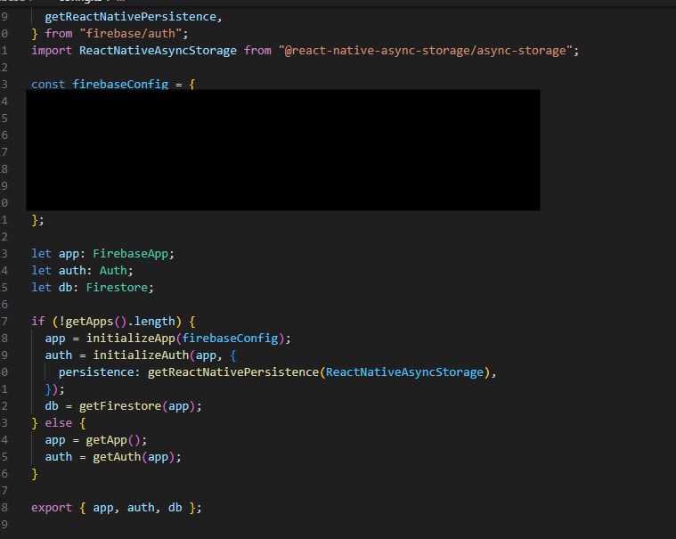

Olá, seja bem vindo ao resultado do meu Tech Challenge ✌️. Meu nome é João Woigt, meu é rm356898, você pode ler mais sobre mim no final deste ReadMe na sessão Sobre o desenvolvedor

## Iniciando o projeto

### Via terminal

Apos clonar o projeto, no terminal dentro da pasta rode o comando para instalar as dependencias:

```bash
npm install
```

Em seguida, será necessário ter algum simulador de celular rodando em seu computador no momento. Rode o comando:

```bash
npm start
```

Apos completar o processo, prescione **A** para iniciar o projeto em seu simulador

## Configuração do firebase no projeto

- Crie um projeto proprio no seu console do firebase
- Na tela inicial, siga as instruções de web para adicionar o firebase ao projeto
  
- Registre o projeto
- voce recebera o código padrão para as configurações
  
- Copie estes dados e cole no arquivo firebase/config.ts
  

## Utilizado no projeto

- React Native
- Expo
- Firebase (auth e cloudstore)
- Context Api
- TypeScript

## Sobre o desenvolvedor

Olá, meu nome é João Woigt, sou desenvolvedor deste 2020 quando decidi fazer a transição da minha area de estudo (Ciências Socias) para a programação a fim de encontrar melhores oportunidades. Participei de diversos bootcamps, em destaque O Santander Bootcampo | Mobile developer e o curso da Ada Tech Web full-stack. Hoje me especializo em desenvolvimento mobile, com foco em Android e Kotlin multiplataforma. Atuo faz 4 anos na area, tendo passado por projetos como Rock in Rio, Banco Pan e Stone, onde me encontro empregado atualmente.
Fique a vontade para se conectar em meu [Linkedin](https://www.linkedin.com/in/joaowoigt/)
